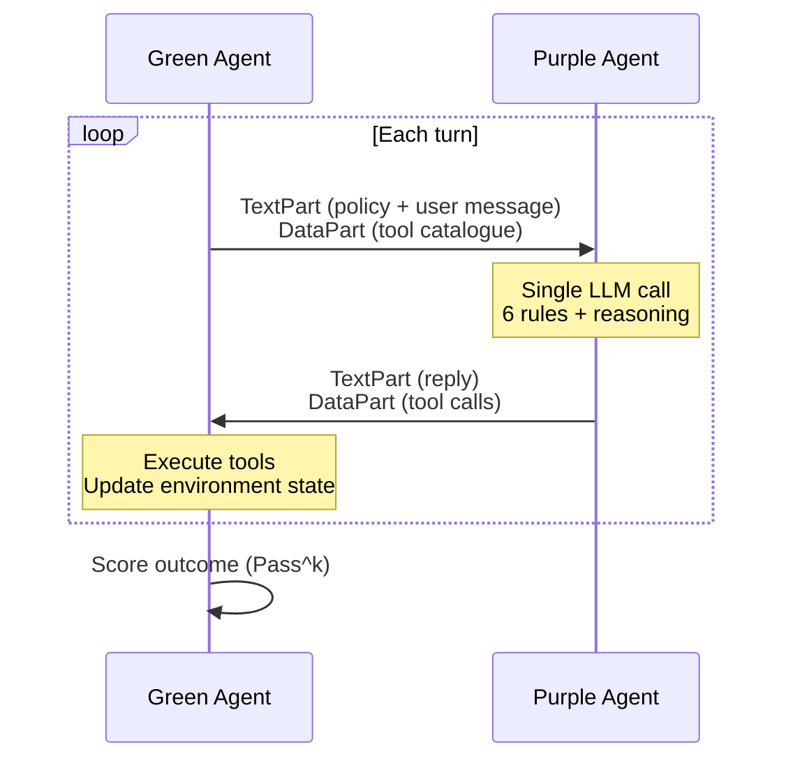

# CAR-bench Purple Agent

Purple agent for the **AgentX-AgentBeats** competition — **CAR-bench** track.

## Abstract

CAR-bench measures whether an in-car voice assistant stays consistent across
trials, obeys the policies it is given, resolves ambiguous requests through
the prescribed escalation path, and refuses actions it cannot perform. Its
headline metric, `Pass^k`, is the fraction of tasks that succeed on *all* `k`
independent trials, so a single stochastic slip collapses a task's score to
zero.

This submission is a deliberately minimal purple agent. It is a **single-pass
A2A executor**: one LLM call per turn, with the full tool catalogue and the
full policy text (as received from the green agent) visible to the model on
every call. There is no planner, no tool-selector, no separate policy
checker. The motivation is that the green agent already encodes every rule
the task needs; the purple agent's job is to obey those rules, and any
pipeline stage that re-summarises either the tool list or the policy text
risks dropping the one clause a later stage would have needed.

The system prompt contains six domain-agnostic rules plus an agent-persistence
directive: (1) capability check — never fabricate a tool or fake a result;
(2) policy compliance — verify prerequisites via information-gathering tools
before any state change; (3) resolve ambiguity via the procedure the
instructions define, treating a clarification question as a last resort; (4)
gather before act; (5) minimise state changes; (6) follow the output format
the instructions specify. The prompt contains no vehicle terminology, no
policy text, and no task identifiers; swapping in a different CAR-bench-style
benchmark would require changing nothing in the agent.

The agent runs on `gpt-5-mini` with `reasoning_effort=high` and
`temperature=1.0`. Evaluated results are published on the
[CAR-bench leaderboard](https://github.com/RDI-Foundation/car-bench-agentbeats-leaderboard).

## Architecture



## Layout

Entry point: `src/server.py` (A2A server exposing `/.well-known/agent-card.json`).
Executor: `CARBenchAgentExecutor` in `src/car_bench_agent.py`.

```
src/
  car_bench_agent.py           # Agent executor (single-pass, 6 rules)
  server.py                    # A2A server entry point
  logging_utils.py             # Loguru + turn tracing
  tool_call_types.py           # Pydantic models for A2A tool calls
amber/
  amber-manifest-purple.json5  # Amber deployment manifest (agentbeats.dev)
Dockerfile                     # linux/amd64 image for agentbeats.dev
.env.example                   # Env var template
```

## License

MIT
